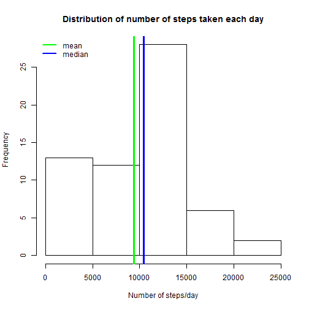
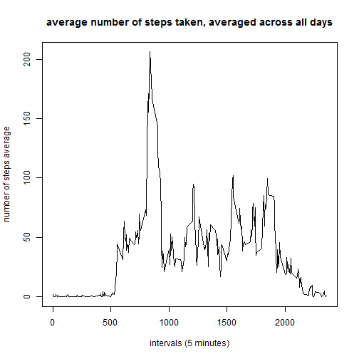
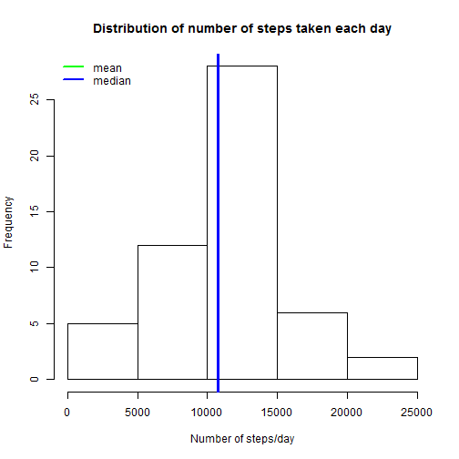
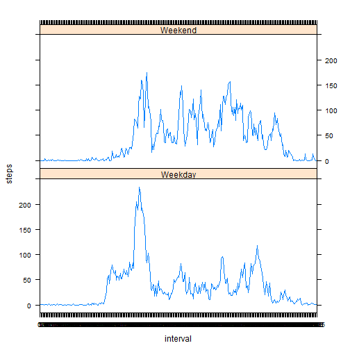

#### load data & process/transform data & explore
*For this part of the assignment, you can ignore the missing values in the dataset.*  
We cast the three columns to "integer","Date","integer"  
By way of exploration, let's do a summary


```r
data = read.csv("activity.csv", colClasses=c("integer","Date","integer"))
summary(data)
```

```
##      steps             date               interval     
##  Min.   :  0.00   Min.   :2012-10-01   Min.   :   0.0  
##  1st Qu.:  0.00   1st Qu.:2012-10-16   1st Qu.: 588.8  
##  Median :  0.00   Median :2012-10-31   Median :1177.5  
##  Mean   : 37.38   Mean   :2012-10-31   Mean   :1177.5  
##  3rd Qu.: 12.00   3rd Qu.:2012-11-15   3rd Qu.:1766.2  
##  Max.   :806.00   Max.   :2012-11-30   Max.   :2355.0  
##  NA's   :2304
```

#### calculate (& report) mean and median of the total number of steps taken per day  

```r
totalSteps<- sapply(split(data$steps,data$date),sum, na.rm=TRUE)
m1 <- mean(totalSteps)
m2 <- median(totalSteps)
```

##The mean of the total number of steps taken per day is 9354.  
##The median of the total number of steps taken per day is 10395.  

#### make a histogram  
Let's add mean and median  

```r
hist(totalSteps, xlab="Number of steps/day", main="Distribution of number of steps taken each day")
abline(v=m1, col="green", lwd=3)
abline(v=m2, col="blue", lwd=3)
legend(x="topleft", legend=c("mean","median"), col=c("green","blue"), bty="n", lwd=2)
```

 

#### what is the average daily activity pattern --> make a time series plot 

We need to:    
- split data in 5-minute intervals    
- calculate average in each interval  
- take the unique intervals for the plot  
- plot and assign labels to the axes  


```r
averageInterval<-sapply(split(data$steps,data$interval),mean,na.rm=TRUE)
intervals<- unique(data$interval)
plot(x=intervals,y=averageInterval,type='l', main="average number of steps taken, averaged across all days", xlab='intervals (5 minutes)',ylab='number of steps average')
```

 

#### calculate 5-minute interval that, on average, contains max number of steps

We need to:  
- split data in 5-minute intervals  
- calculate sum in each interval  
- find the index of interval with max steps


```r
totalInterval<-sapply(split(data$steps,data$interval),sum,na.rm=TRUE)
temp <- which.max(totalInterval)
maxInterval <- intervals[temp]
```

##The 5-minute interval that, on average across all the days in the dataset, contains the maximum number of steps, is: 835. This confirms the plot above.  

#### calculate and report the total NAs


```r
totalMissing <- sum(is.na(data$steps))
```

##The total number of missing values in the dataset (i.e. the total number of rows with NAs) is: 2304.

#### create a new dataset equal to  original dataset but with  missing data filled in  
I will use the mean of the intervals to fill in the NAs & use the plyr lib to do operations on the df  
We need to:   
- make a new df without NAs  
- create a new dataset  
- locate NAs  
- group by interval using plyr  
- convert to factors  
- fill in NAs  


```r
library(plyr)
data2 <- data[!is.na(data$steps), ]
newData <- data2
missings <- is.na(newData$steps)
groupAverageInterval <- ddply(data, ~interval, summarise, mean = mean(steps))
newData$interval <- factor(newData$interval)
groupAverageInterval$interval <- factor(groupAverageInterval$interval)
newData[missings, "steps"] <- groupAverageInterval[newData[missings, "interval"], "mean"]
#summary(newData)
```

#### calculate the total number of steps taken per day & make a histogram
*Previous code can be reused, however execute on different df*  

```r
totalSteps2<- sapply(split(newData$steps,newData$date),sum, na.rm=TRUE)
#head(totalSteps2)
m3 <- mean(totalSteps2)
m4 <- median(totalSteps2)
hist(totalSteps2, xlab="Number of steps/day", main="Distribution of number of steps taken each day")
abline(v=m3, col="green", lwd=3)
abline(v=m4, col="blue", lwd=3)
legend(x="topleft", legend=c("mean","median"), col=c("green","blue"), bty="n", lwd=2)
```

 

#### calculate (& report) mean and median of the total number of steps taken per day

*Previous code can be reused, however execute on different df*  

##The mean of the total number of steps taken per day is 10766.  
##The median of the total number of steps taken per day is 10765.  

#### do these values differ from the estimates from the first part of the assignment? 
##Yes, they do. The mean is higher (9354 -> 10766) and the median is lower (10765 -> 10395)  
#### what is the impact of imputing missing data on the estimates of the total daily number of steps?
##The histogram changed significantly.

#### create a new factor variable in the dataset with two levels - "weekday" and "weekend"
We need to:  
- add a new column for day of week  
- fill in column with day  
- convert column to either Weekday or Weekend  
- convert  to factor  


```r
newData$weekday = weekdays(newData$date)
#head(newData)
newData$weekday.type <- ifelse(newData$weekday == "zaterdag" | newData$weekday == "zondag", "Weekend", "Weekday")
newData$weekday.type <- factor(newData$weekday.type)
#head (newData)
```

#### make a panel plot


```r
steps <- aggregate(steps ~ interval + weekday.type, data=newData, FUN=mean)
names(steps) <- c("interval", "weekday.type", "steps")

library(lattice)
xyplot(steps ~ interval | weekday.type, steps, type = "l", layout = c(1, 2))
```

 

##Yes, there are  differences in activity patterns between weekdays and weekends. For one, overall activity is higher on weekends.
